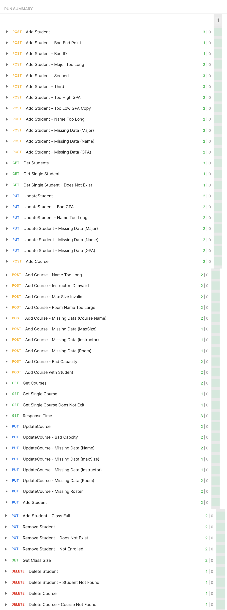

# Software Testing Lab 5 - API Testing

[cite_start]This repository contains the backend code and automated API testing suite for a class roster system supporting CRUD operations for Students and Courses[cite: 13]. 

## Core Project Links
* **[Postman Collection (JSON)](src/test/resources/postman/StudentRegDemo.postman_collection.json)**
* **[Student Controller](src/main/java/com/baarsch_bytes/studentRegDemo/controller/StudentController.java)**
* **[Course Controller](src/main/java/com/baarsch_bytes/studentRegDemo/controller/CourseController.java)**

## Test Case Documentation
[cite_start]For a complete, line-by-line breakdown of all expected and actual behaviors, please view the attached **[Test Case Documentation](TestCases.md)**.

## Postman Test Results
This automated testing suite utilizes both Black Box & White Box test design to evaluate input equivalence partitions, boundary values, business rules, and missing data fail states

Below is the execution proof showing a 100% pass rate across the collection:

